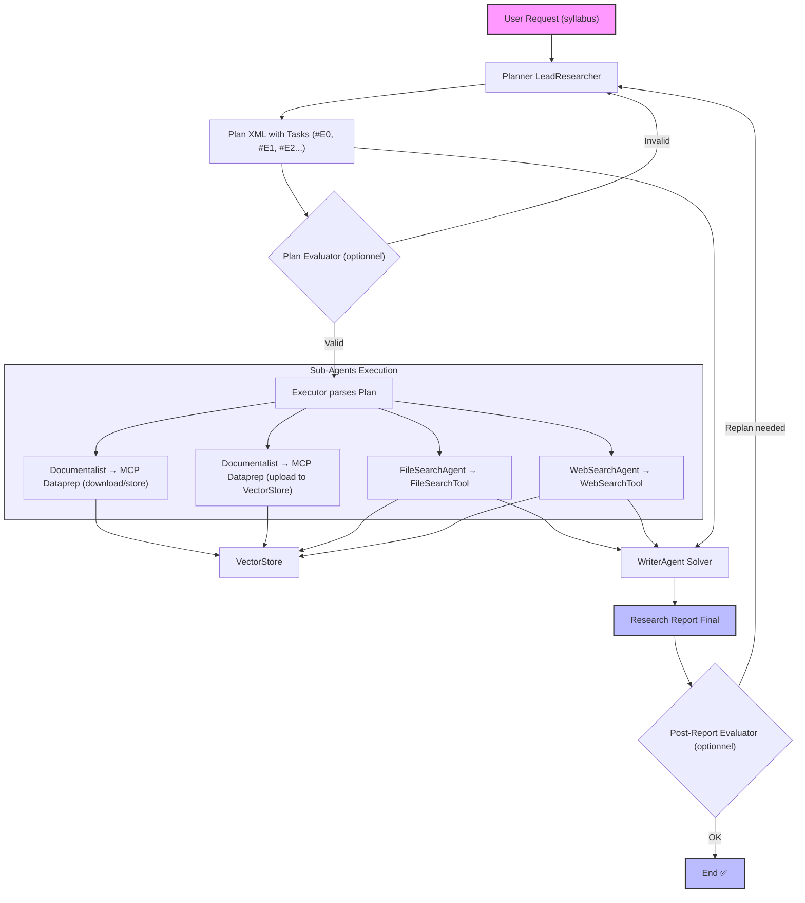

## 📚 **Description détaillée du workflow `agentic-research`**

---

### 🧩 **Rôle principal : `planner-agent` (LeadResearcher)**

\*\*Le `planner-agent` agit comme un **LeadResearcher** :
Il reçoit un **syllabus** comme entrée et génère un **plan d’exécution** complet.
Ce plan décompose la recherche en **tâches séquentielles**, chacune orchestrée par un **sous-agent** dédié (Documentalist, FileSearchAgent, WebSearchAgent, WriterAgent).

---

## 🔍 **1. Analyse du syllabus**

Le `planner-agent` lit le syllabus et distingue **trois types de références** :

---

#### ✅ **A) Références internes à la base de connaissances**

- Repérées par un **nom de fichier** déjà présent dans la base (ex : `Prompt_Engineering_for_Developers.txt`, `03_Adversarial_Attacks_on_LLMs.md`).
- Le `planner-agent` vérifie l’existence en interrogeant le **MCP Dataprep** (`KnowledgeDatabase`).

---

#### ✅ **B) Références externes à intégrer**

- Repérées par une **URL** placée dans la **section Références** du syllabus.
- Ces URLs désignent des **contenus longs termes** à télécharger, convertir en markdown, indexer localement et ajouter à la base de connaissance.
- Après intégration, la référence URL est remplacée par le **nom de fichier** correspondant dans le plan d’exécution.

---

#### ✅ **C) Citations éphémères**

- Des URLs intégrées **dans la description textuelle** de modules du syllabus.
- **Ne doivent pas être ajoutées à la base de connaissance** (elles ont une durée de vie courte, servent à enrichir un passage précis).
- Ces liens servent uniquement à alimenter une **requête WebSearch ponctuelle** pour extraire une anecdote, statistique ou citation.

---

## ✅ **Règle de positionnement :**

- **Références structurantes = Section Références du syllabus.**
- **Citations éphémères = Description textuelle des modules.**

---

## ✨ **2. Métadonnées et enrichissement**

- Une **URL** peut être accompagnée de **texte** et de **keywords** dans le syllabus → ces éléments alimentent directement l’entrée `KnowledgeEntry` (via Documentalist).
- Si aucun **résumé/keywords** n’est fourni, le `Documentalist` déclenche un **appel LLM** pour :

  - Générer un résumé,
  - Extraire des keywords.

- L’entrée `KnowledgeEntry` inclut alors :

  ```
  {
    url: "…",
    filename: "…",
    keywords: ["…"],
    openai_file_id: "…" (optionnel)
  }
  ```

---

## 🗂️ **3. Génération du brief de recherche**

Une fois la phase de parsing faite :

- Le `planner-agent` analyse l’**agenda du syllabus** pour définir :

  - Les **thèmes majeurs**,
  - Les sous-thèmes,
  - Les **axes de recherche**.

- Il produit un **brief de recherche** structuré qui oriente :

  - Les requêtes `FileSearchAgent` (base de connaissance)
  - Les requêtes `WebSearchAgent` (sources externes)

- Le brief est **persisté localement** pour assurer un **tracing reproductible**.

---

## ⚙️ **4. Génération du plan d’exécution**

Le `planner-agent` structure le plan d’exécution **au format XML** (parse-friendly).
Il adopte le paradigme **ReWoo** (_Reasoning + World Observation_), inspiré de [ReWOO](https://arxiv.org/abs/2305.18323) :

- Chaque **tâche** est décrite pas à pas.
- Chaque tâche produit une **variable** `#E{n}`.
- Ces variables sont substituées pour chaîner les résultats entre outils / agents.

---

### ✅ **Exemple de plan :**

```plaintext
#E0 = Documentalist[vector_store="AI Engineer Basic Course Syllabus"]
#E1 = Documentalist[name="Prompt_Engineering_for_Developers.txt", vector_store=#E0]
#E2 = Documentalist[url="https://huyenchip.com/2025/01/07/agents.html", name="Agents By Chip Huyen", keywords=["Agents", "Planning"], vector_store=#E0]
#E3 = FileSearch["Prompt Engineering", vector_store=#E0]
#E4 = FileSearch["Multi-Agent Systems", vector_store=#E0]
#E5 = WebSearch["Key Takeaways on multi-agent orchestration", "https://blog.langchain.com/exa/"]
```

---

## 🧩 **5. Orchestration par sous-agents**

---

### 🗂️ **Documentalist**

- **Télécharge** les références manquantes.
- **Convertit** en markdown.
- **Ajoute** au `KnowledgeDatabase`.
- Gère l’**upload** vers le vector store unique pour la recherche.
- **Enregistre** l’`openai_file_id` à la première transmission au Files API pour éviter des doublons lors des attachements suivants.
- Utilise **MCP Dataprep**.

---

### 🔍 **FileSearchAgent**

- Reçoit une **requête sémantique** (avec contexte + question).
- Cherche dans le **vector store** alimenté par le Documentalist.
- Utilise la **FileSearchTool**.
- Extrait le contenu **sans transformation superflue**, conserve les **références sources**.

---

### 🌐 **WebSearchAgent**

- Recherche **sur le web** (ex : Tavily).
- Extrait **anecdotes, statistiques, citations** hors base de connaissance.
- Peut être invoqué directement par le `planner-agent` si un **gap de contenu** est détecté.

---

### ✍️ **WriterAgent**

- Compile :

  - Le **brief**
  - Les **extraits FileSearch**
  - Les **anecdotes WebSearch**

- Génère une **note de recherche complète**, structurée par thèmes et sous-thèmes.
- Intègre :

  - Des illustrations, exemples, extraits de code,
  - Les **références** pour chaque concept cité.

---

## ✅ **6. MCP Dataprep**

- **Point d’entrée unique** pour :

  - Vérifier existence d’un document (`find_by_name`).
  - Télécharger/transformer.
  - Sauvegarder dans `KnowledgeDatabase`.
  - Gérer le `openai_file_id` pour attachement vector store.

---

## 🚦 **7. Exigences & Priorités**

| Ref | Exigence                                          | Priorité |
| --- | ------------------------------------------------- | -------- |
| A   | Extraction des références                         | P0       |
| B   | Téléchargement des contenus manquants             | P1       |
| C   | Extraction manuelle des descriptions / keywords   | P3       |
| D   | Génération automatique résumé + keywords          | P2       |
| E   | Génération d’Augmented Query (Query Expansion)    | P3       |
| F   | WebSearch Agent (usage planifié, pas prioritaire) | P3       |

---

## ✅ **8. Clarifications finales**

- 📌 **Pas de cache mémoire** : Lookup disque uniquement via `knowledge_db.json`.
- 📌 **Parallélisme** : orchestré côté **workflow agentique**, pas implémenté dans `MCP Dataprep` directement.
- 📌 **Format du plan** : XML, pour parsing robuste.
- 📌 **Substitution `#E{n}`** : une tâche = une variable, pour chaînage simple et maintenable.

---

## ✔️ **Résumé**

👉 Le **LeadResearcher** agit comme orchestrateur intelligent.
👉 `Documentalist` sécurise la base de connaissance, le vector store et les métadonnées.
👉 `FileSearchAgent` et `WebSearchAgent` extraient la matière brute.
👉 `WriterAgent` synthétise une **note finale** claire, exhaustive, sourcée.

Tout repose sur une chaîne **MCP** + **API Vector Store** cohérente, sans doublons, **tracée** et **rejouable**.

---


