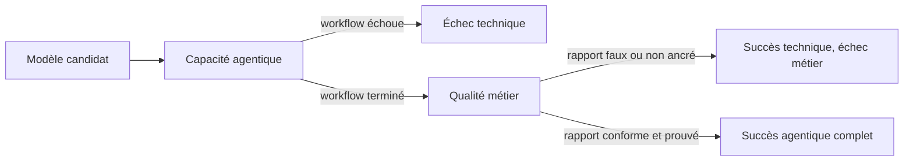
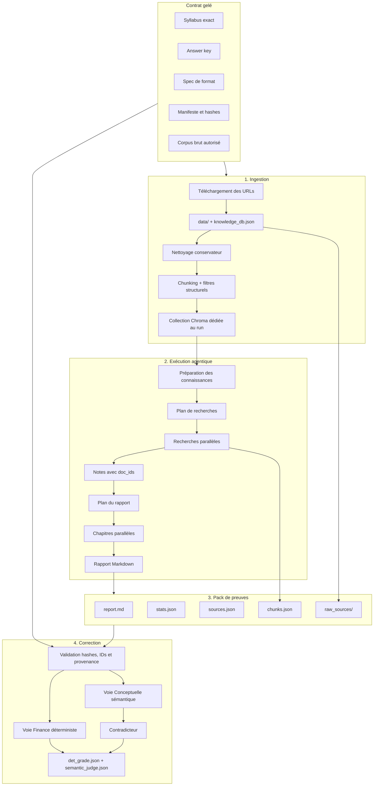
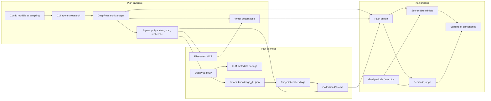
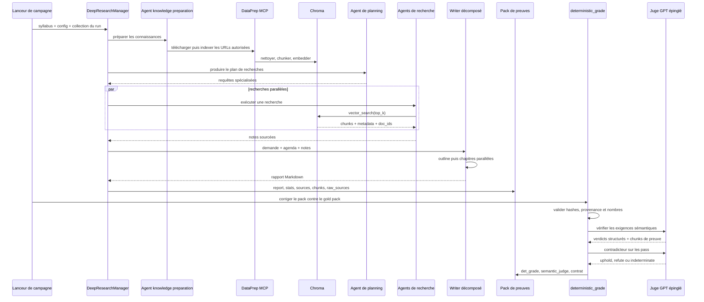
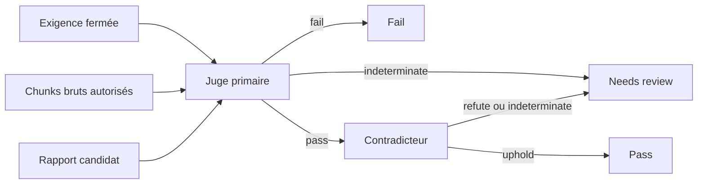
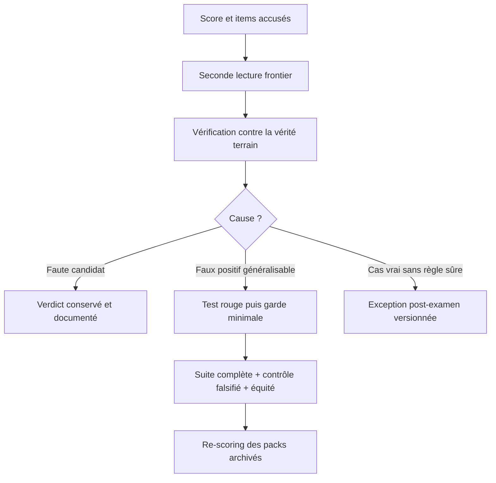
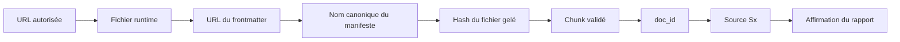

# Benchmarker un système de recherche agentique sans se mentir

## Résumé

Comparer des modèles de langage sur une question simple est déjà difficile. Comparer
des systèmes de recherche agentique l'est davantage : le résultat dépend du modèle,
mais aussi de l'ingestion, du moteur de recherche, des outils, du plan, de la rédaction,
des citations et de l'évaluateur lui-même.

Notre première approche reposait sur un juge LLM généraliste. Elle était flexible, mais
un rapport contenant des chiffres inventés pouvait néanmoins recevoir une excellente
note. Nous avons donc remplacé cette confiance implicite par un benchmark fermé,
reproductible et fondé sur des preuves.

La nouvelle version combine deux voies :

- une voie Finance, où Python reste l'autorité sur les chiffres ;
- une voie Conceptuelle, où un LLM puissant vérifie une grille fermée à partir des
  chunks réellement récupérés, puis un second passage tente de réfuter chaque succès.

Dans les deux voies, une seconde lecture frontier audite ensuite les décisions de
l'évaluateur avant publication, sans se substituer à lui.

Le principe central est simple : un score n'est crédible que si l'on peut reconstruire
ce que le système a vu, ce qu'il a écrit, comment il a été jugé et pourquoi il a échoué.

> État au 17 juillet 2026 : l'architecture est en place, les blocages trouvés pendant
> la première passe ont été corrigés et les packs ont été re-scorés sans relancer les
> candidats. La campagne N=5 couvre huit modèles ; les exceptions post-examen et les
> exclusions de runs sont versionnées avec le benchmark.

## 1. Ce que nous benchmarkons réellement

Nous ne benchmarkons pas seulement un modèle. Nous benchmarkons une chaîne complète :

1. comprendre une demande de rapport ;
2. télécharger et indexer les sources autorisées ;
3. planifier les recherches ;
4. retrouver les bons passages ;
5. transformer ces passages en notes sourcées ;
6. produire un rapport structuré ;
7. vérifier le rapport contre une vérité terrain gelée ;
8. expliquer l'origine d'un échec.

Les modèles cibles sont des modèles medium, typiquement de 24 à 250 milliards de
paramètres, servis localement sur un ou deux DGX Spark ou accessibles par API. Ils
incluent des architectures instruct, reasoning ou MoE, par exemple Qwen, MiniMax,
Mistral, Nemotron, Gemma et des modèles GPT de référence.

La cible fonctionnelle est volontairement réaliste : un travail d'analyste junior,
factuel, sourcé et sans opinion d'investissement.

### L'unité évaluée est un système agentique, pas un modèle isolé

Ce benchmark évalue la capacité d'un modèle à fonctionner dans un workflow métier de
deep research. Le modèle doit successivement :

- respecter les rôles de plusieurs agents spécialisés ;
- produire des sorties structurées conformes aux schémas attendus ;
- appeler des fonctions avec les bons arguments ;
- préparer et indexer les sources ;
- construire un plan de recherche ;
- interroger un système RAG ;
- conserver la chaîne chunk -> source -> citation ;
- rédiger plusieurs sections puis les assembler ;
- livrer un rapport conforme à une demande métier.

Ce n'est donc ni un benchmark de code, ni un test de génération de texte isolée. C'est
un benchmark de **comportement agentique non-code** dans une application métier.

Le système testé comprend le modèle, son serveur d'inférence, le parser de tool calls,
les prompts, l'interface des outils, le retrieval commun et l'orchestration. Changer
l'un de ces éléments peut changer le résultat, même si les poids du modèle restent les
mêmes.

### Deux niveaux de réussite



La première question est : le modèle sait-il utiliser le système jusqu'au bout ? La
seconde est : le livrable obtenu est-il exact, complet et ancré aux preuves ?

Les modèles de la campagne parviennent désormais majoritairement à terminer le
workflow avec les interfaces et paramètres stabilisés. Cette réussite technique est un
résultat important : elle montre que des modèles medium peuvent opérer un système
multi-agent avec planning, RAG, outils et writer décomposé sur un exercice métier.

Elle ne suffit toutefois pas à garantir la qualité du rapport. Qwen peut, par exemple,
terminer correctement toute la chaîne puis produire des agrégats faux ; un autre modèle
peut livrer un rapport lisible mais mal relier ses explications aux chunks récupérés.

## 2. Pourquoi un benchmark agentique est difficile

### Le modèle n'est qu'une variable parmi d'autres

Un mauvais score peut venir du modèle, mais aussi d'une source non téléchargée, d'un
nom de fichier mal transmis à un outil, d'un filtre d'ingestion trop agressif, d'un
chunk non récupéré, d'une citation sans identifiant brut ou d'un juge tronqué.

Sans artefacts intermédiaires, toutes ces causes se ressemblent : le rapport final est
incomplet. Un benchmark utile doit donc mesurer le résultat et conserver la chaîne de
causalité.

### Une sortie générative varie par nature

Deux runs du même modèle peuvent choisir des recherches, des tableaux et des
formulations différentes. Une règle fondée sur une mise en page ou une expression
précise sur-apprend vite quelques rapports de calibration.

La règle retenue est donc : stricte sur le fond, tolérante sur la forme, sauf lorsqu'un
format est explicitement demandé par le syllabus.

### L'évaluateur peut être plus dangereux que le modèle

Un juge LLM ouvert peut rationaliser une erreur, suivre une citation décorative ou
compléter depuis sa mémoire une information absente des preuves. Il produit alors un
faux positif avec une apparence de sophistication.

À l'inverse, un parseur déterministe trop ambitieux peut confondre une soustraction et
un nombre négatif, attribuer une valeur à la mauvaise métrique ou accuser une
formulation correcte qu'il ne sait pas lire.

La fiabilité vient donc d'un partage explicite des responsabilités, pas d'un juge
universel.

## 3. De l'approche générale à un benchmark fermé

### Version historique : un juge LLM généraliste

La première version cherchait à évaluer n'importe quelle demande de rapport. Elle
combinait qualité, groundedness, conformité au brief et signaux de type RAG-triad.

Cette approche avait trois avantages :

- elle acceptait des demandes variées ;
- elle comprenait mieux la prose qu'un ensemble de regex ;
- elle pouvait produire une appréciation qualitative riche.

Mais elle avait une faiblesse rédhibitoire pour un comparatif fiable : elle ne
connaissait pas toujours la réponse exacte attendue. Un juge trop conciliant pouvait
donc valider un rapport plausible mais faux.

### Nouvelle version : deux exercices connus

Nous avons choisi de perdre en généralité pour gagner en certitude. Le benchmark porte
sur deux exercices fixes :

1. un rapport Finance sur l'intensité capitalistique de six grandes entreprises
   technologiques ;
2. un rapport Conceptuel expliquant des notions d'ingénierie IA et de systèmes
   agentiques.

Pour chaque exercice, nous connaissons la demande exacte, les sources autorisées, les
attendus, les erreurs critiques et les étapes intermédiaires observables.

Le benchmark ne demande plus à l'évaluateur de découvrir ce qui est vrai. Il lui
demande de vérifier un contrat fermé.

### Les deux voies de la nouvelle version

| Question | Finance | Conceptuel |
|---|---|---|
| Nature de la vérité | 42 faits et dérivations numériques | 16 exigences sémantiques fermées |
| Autorité principale | Code déterministe | Juge GPT épinglé |
| Rôle du LLM évaluateur | Veto d'adéquation seulement | Produit les verdicts pass/fail/indeterminate |
| Double contrôle | Whitelist, attribution, anti-fabrication | Juge puis contradicteur sur les pass |
| Score publié | Score numérique déterministe | Pourcentage d'exigences passées |
| Qualification | Déterministe ET absence de veto | Toutes les exigences critiques passent sans erreur de protocole |
| Diagnostic secondaire | Root cause retrieval/writer/contrat | Ancien score lexical non autoritaire |

## 4. Architecture générale



### Lecture simplifiée

```text
Contrat gelé
    |
    v
Télécharger -> nettoyer -> chunker -> indexer
    |
    v
Planifier -> rechercher -> rédiger
    |
    v
Archiver rapport + sources + chunks bruts + métriques
    |
    +--> Finance : vérification mécanique des chiffres + veto d'adéquation
    |
    +--> Conceptuel : grille fermée -> juge -> tentative de réfutation
    |
    v
Score diagnostique + qualification + cause racine + preuves rejouables
```

### Vue par composants



Le plan candidat produit le rapport. Le plan données contrôle ce qui peut être vu. Le
plan preuves observe les deux sans modifier leur comportement. Cette séparation évite
qu'un correctif du scorer change silencieusement le système candidat.

### Séquence complète d'un run



### Carte des composants dans le dépôt

| Composant | Responsabilité | Emplacement principal |
|---|---|---|
| Orchestrateur | Phases, timings, tokens, persistance du pack | `src/deep_research_manager.py` |
| Préparation | Téléchargement et passage des noms de fichiers | `src/agents/knowledge_preparation_agent.py` |
| DataPrep MCP | Outils download, upload, inventaire et recherche | `src/mcp/dataprep_server.py` |
| Backend vectoriel | Nettoyage, chunking, Chroma, embeddings | `src/dataprep/vector_backends.py` |
| Recherche | Filtrage top-k, diversité et capture des chunks | `src/agents/vector_search_tool.py` |
| Writer | Agrégation, outline, chapitres, assemblage | `src/report_writer/` |
| Pack portable | Rapport, stats, sources, chunks et sources brutes | `src/deep_research_manager.py` |
| Validation des preuves | Hashes, noms canoniques et chaîne source/chunk | `evaluations/chunk_snapshot.py` |
| Scorer Finance | Couverture, exactitude, fabrications et format | `evaluations/deterministic_grade.py` |
| Juge sémantique | Grille fermée, contradicteur et fail-closed | `evaluations/semantic_judge.py` |
| Gold packs | Syllabus, answer key, spec et corpus gelé | `evaluations/exercises/` |

## 5. Étape 1 : ingestion et récupérabilité

Le système télécharge les cinq références déclarées dans le syllabus, les stocke dans
`data/`, puis enregistre leur URL et leur nom dans `knowledge_db.json`. Les documents
sont nettoyés, découpés et indexés dans une collection Chroma propre au run.

Le nettoyage doit être conservateur. Nous avons découvert qu'un ancien filtre conçu
pour supprimer des artefacts d'agents retirait aussi les expressions « system prompt »,
« You are a », « BEGIN » et « END ». Il supprimait donc précisément le sujet de
l'exercice conceptuel. Les blocs de code étaient également supprimés alors qu'ils
contenaient des exemples utiles.

Cette erreur a produit des rapports apparemment faibles alors que l'information avait
été détruite avant même d'atteindre le modèle.

La leçon est générale : avant de noter un concept, il faut prouver qu'il est
récupérable dans le pipeline réel. Une recherche manuelle dans le fichier source ne
suffit pas. Il faut tester la chaîne nettoyage -> chunking -> embedding -> top-k.

## 6. Étape 2 : exécution agentique

Le manager suit quatre phases observables :

1. **knowledge preparation** : téléchargement, stockage et indexation des sources ;
2. **planning** : création d'un plan de recherches spécialisé ;
3. **search** : exécution parallèle des recherches et production de notes avec doc_ids ;
4. **writing** : plan du rapport, rédaction parallèle des chapitres et assemblage.

Le writer décomposé remplace un appel monolithique par un plan structuré suivi de
plusieurs petits appels de rédaction. Cette architecture convient mieux aux modèles
medium : chaque appel est plus borné, les chapitres peuvent être traités en parallèle
et le nombre réel d'appels, de retries, de tokens et la durée par étape sont mesurés.

Le rapport n'est pas le seul résultat. Le système capture aussi les chunks exacts
retournés aux agents avant toute normalisation de présentation.

## 7. Étape 3 : le pack de preuves

Chaque run réussi doit être autoportant.

| Artefact | Rôle |
|---|---|
| `report.md` | Rapport exact évalué |
| `stats.json` | Requête, modèles, timings, tokens, appels et provenance du protocole candidat |
| `sources.json` | Notes agrégées visibles par le rédacteur et leurs IDs S1, S2, etc. |
| `chunks.json` | Chunks bruts réellement retournés par la recherche, avec doc_id et hash |
| `raw_sources/` | Copie des fichiers bruts associés aux chunks |
| `adjudication_contract.json` | Hashes du contrat et paramètres du juge |
| `semantic_judge.json` | Prompts, réponses structurées, verdicts et erreurs de protocole |
| `det_grade.json` | Score, qualification, blockers et cause racine |

Le pack répond à trois questions différentes :

- Qu'est-ce que le modèle pouvait savoir ? `chunks.json` et `raw_sources/`.
- Qu'a-t-il effectivement utilisé ? `sources.json` et les citations du rapport.
- Pourquoi a-t-il été noté ainsi ? `det_grade.json` et `semantic_judge.json`.

Cette séparation est essentielle. Une synthèse d'agent n'est pas une preuve brute :
elle peut déjà contenir une hallucination. Le juge ne doit créditer que des chunks
reliés à des fichiers dont le hash correspond au corpus gelé.

Le bloc provenance de `stats.json` enregistre notamment le SHA Git, l'état dirty, le
hash du fichier de configuration, le nom de la collection Chroma et le fournisseur,
l'endpoint et le modèle d'embeddings. Le pack ne documente donc pas seulement le
résultat ; il documente aussi le protocole qui l'a produit.

## 8. Voie Finance : les chiffres restent mécaniques

L'exercice Finance demande 7 métriques pour 6 entreprises, soit 42 faits FY2025 :
revenu, résultat opérationnel, marge opérationnelle, cash-flow opérationnel, capex,
free cash flow et ratio capex/OCF.

### Autorité numérique

Le score Finance est produit par le code, pas par un LLM. Le scorer vérifie :

- la couverture des 42 faits ;
- l'exactitude des valeurs et périodes dans les lignes canoniques ;
- les affirmations d'indisponibilité ;
- les nombres absents du corpus ;
- les dérivations locales, ou les dérivations quasi exactes rattachées à la série de
  la société explicitement nommée ;
- les chapitres, tableaux, longueur, ton et politique de sources ;
- les causes probables d'échec : retrieval, writer ou contrat.

La doctrine de parsing est asymétrique :

- une ligne reconnue par son contenu complet, société + métrique + période + valeur,
  peut donner du crédit et déclencher une accusation ;
- une lecture dépendant des en-têtes peut donner du crédit, mais ne doit jamais
  accuser, car l'erreur peut venir du parseur lui-même.

Cette asymétrie réduit les faux positifs sur les tableaux produits par des modèles et
dans des langues différentes.

La prose suit une règle plus prudente : le code vérifie d'abord que le numéral existe
dans le corpus ou qu'il correspond à une dérivation précisément justifiable. Il évite
de deviner mécaniquement toute la relation société-métrique-période dans une phrase
libre. Les erreurs d'analyse restantes relèvent du veto sémantique.

### Veto d'adéquation

Un juge LLM séparé vérifie que le rapport répond bien à la demande qualitative :
définitions, calendriers fiscaux, tendances, distinction guidance/actuals, comparaison
et traitement des données manquantes.

Ce juge ne peut pas ajouter de points numériques et ne peut jamais réhabiliter un
échec déterministe. Il peut uniquement bloquer une qualification qui aurait autrement
passé.

La sortie Finance doit donc être lue en deux colonnes :

1. score numérique déterministe ;
2. qualification finale après veto d'adéquation.

Les deux ne doivent pas être fusionnés dans une moyenne opaque.

## 9. Voie Conceptuelle : vérifier une réponse connue

L'exercice conceptuel ne peut pas être correctement évalué par simple recherche de
mots-clés. Mentionner « RAG », « ReAct » ou « function calling » ne prouve pas que le
rapport les explique correctement.

L'answer key déclare donc, pour chaque exigence :

- la réponse attendue en langage naturel ;
- les points obligatoires ;
- les erreurs critiques ;
- le statut attendu, supporté ou source gap ;
- les fichiers sources autorisés.

Le juge GPT épinglé reçoit la demande, le rapport complet, une seule exigence et les
chunks bruts autorisés. Il doit produire un verdict catégoriel : pass, fail ou
indeterminate. Sa confiance déclarée est conservée pour la revue humaine mais n'entre
jamais dans la décision.

Un contradicteur n'est appelé que sur les pass. Son rôle n'est pas de refaire la note,
mais de chercher une omission, une contradiction, une extrapolation non supportée ou
un blanchiment de citation.



Le scoring lexical historique est conservé comme diagnostic local gratuit, mais il ne
qualifie plus un rapport.

## 10. Qualification, score et fail-closed

Le benchmark sépare volontairement un score diagnostique d'une qualification.

- Un score indique combien d'attendus ont été satisfaits ou combien de faits ont été
  couverts.
- Une qualification indique si le résultat peut être considéré comme fiable selon le
  contrat complet.

Une erreur de protocole, un chunk non traçable, un contrat différent, un désaccord du
contradicteur ou une sortie structurée invalide bloque la qualification.

Important : dans l'implémentation actuelle, fail-closed signifie `qualified=false`.
Le score diagnostique peut rester non nul, notamment en Finance ou lorsqu'une partie
des exigences conceptuelles a déjà été jugée. Un agrégateur de campagne doit donc
exclure ou isoler explicitement les runs `evaluation_failed` au lieu de calculer une
médiane aveugle sur le seul champ `score`.

### Comment lire un résultat

| État | Interprétation | Utilisation dans la campagne |
|---|---|---|
| Workflow failed | Le candidat n'a pas produit de rapport exploitable | Échec candidat, score 0, conservé dans la distribution |
| `evaluation_failed` | Le rapport existe mais son adjudication n'est pas complète | Score diagnostique seulement ; politique d'agrégation explicite requise |
| Complete, non qualifié | Correction terminée avec blockers factuels ou contractuels | Résultat candidat valide mais insuffisant |
| Complete, qualifié | Toutes les portes du contrat sont franchies | Succès vérifié |

La cause racine complète la note :

- **alimentation** : source absente ou non indexée ;
- **retrieval** : vérité présente dans le corpus mais non récupérée ;
- **writer** : preuve récupérée mais omise, déformée ou mal citée ;
- **adjudication** : juge indéterminé, contradicteur en désaccord ou protocole invalide ;
- **contrat** : requête, hash, format ou source non conforme.

### Tableau de bord agentique et tableau de bord métier

Les métriques de processus existent déjà principalement dans `stats.json`, même si
elles ne sont pas fusionnées dans le score du rapport.

| Plan | Signaux observables |
|---|---|
| Exécution agentique | succès du workflow, phase d'échec, appels et retries, sorties structurées invalides |
| Planning et recherche | nombre de recherches, sources et chunks récupérés, doc_ids résolus |
| Writer multi-agent | chapitres planifiés, chapitres vides, appels parallèles, respect du contrat de sortie |
| Efficacité | durée et tokens par phase, débit de rédaction, ratio de concurrence |
| Livrable Finance | couverture, exactitude, fabrications, format, adéquation |
| Livrable Conceptuel | exigences passées, source gaps, ancrage des citations, désaccords du contradicteur |

Ces deux tableaux ne doivent pas être réduits à un score composite. Un modèle qui
termine 100 % des workflows mais produit parfois des faits faux est techniquement
capable mais peu fiable sur le plan métier. Un modèle très exact lorsqu'il termine, mais qui
échoue une fois sur trois pendant les tool calls, pose un autre risque opérationnel.

Pour une publication, la lecture recommandée est donc :

1. **taux de complétion agentique** et répartition des échecs par phase ;
2. **distribution de qualité métier** sur les runs terminés ;
3. **coût opérationnel** en temps, tokens et appels ;
4. **modes d'échec qualitatifs** observés dans les packs.

## 11. La troisième couche : une seconde lecture frontier

Les deux évaluateurs techniques ne suffisent pas à eux seuls. Le scorer déterministe
est reproductible, mais il ne comprend pas toute la variété de la prose. Le juge
evidence-bound comprend le texte, mais il reste probabiliste. Nous leur ajoutons donc
une troisième couche : **avant publication, aucun score n'est accepté sans relire ce
qui l'a causé**.

Cette seconde lecture est réalisée avec un modèle frontier. Elle ne remplace ni le
scorer ni le juge et ne renote pas librement les rapports. Elle audite leurs décisions
selon une boucle stable :

1. lire les items accusés dans le pack, et non le score seul ;
2. recalculer ou vérifier manuellement l'affirmation contre la vérité terrain ;
3. distinguer une vraie faute du candidat d'un faux positif de l'évaluateur ;
4. pour un faux positif généralisable, écrire d'abord un test rouge, ajouter la garde
   minimale, puis rejouer toute la suite, le contrôle falsifié et les contre-tests
   d'équité ;
5. re-noter les packs archivés, sans relancer les modèles candidats.



Cette campagne a ainsi révélé **environ 18 familles** de faux positifs ou de
conventions d'interface : deltas éloignés de leurs opérandes, ratios recalculés,
localisateurs de citation pris pour des nombres, tableaux de guidance, dates, seuils
hedgés, échelles d'unités ou encore identifiants de chunks transcodés. Chaque famille
a été exposée par une manière d'écrire différente.

L'effet n'était pas marginal. Avant seconde lecture, le pire run de gpt-5.6-sol
obtenait 60,0 et plaçait ce modèle sous gpt-5.4-mini. Après correction des faux
positifs de l'évaluateur, le même pack atteint 86,4. **Sans cette troisième couche, le
classement publié aurait été faux à cause de l'instrument de mesure, pas des modèles.**

### Le contrôle falsifié : tester aussi les permissions accordées au scorer

Corriger une sur-accusation peut ouvrir une échappatoire plus grave : une règle conçue
pour accepter une formulation correcte peut aussi blanchir un chiffre inventé. Le
benchmark contient donc un rapport falsifié avec trois valeurs plantées : 88,7 de
revenu data-center, 137 de croissance et 210,5 de carnet de commandes.

Après chaque modification de l'évaluateur, le résultat attendu reste **exactement 3/3** :
ni moins, ce qui signalerait un blanchiment, ni plus, ce qui signalerait une nouvelle
sur-accusation. Ce test symétrique a notamment rejeté deux élargissements trop
généreux : des tolérances de dérivation lâches et la recherche combinatoire de paires
ou sous-ensembles multi-sociétés. Le pack hôte du contrôle est épinglé, car une des
détections dépendait sinon du corpus hôte utilisé pour la comparaison.

Le contrôle falsifié n'est donc pas un exemple décoratif. C'est le test de
non-régression du filet anti-blanchiment.

### Les exceptions sont des données, pas de nouvelles règles

Certains rapports sont exacts sans qu'il existe de règle générique assez sûre pour les
créditer. Une somme de plusieurs entreprises peut être vérifiée à la main, mais
autoriser toutes les sommes de sous-ensembles créerait une vaste surface de
blanchiment.

Nous traitons ce cas comme une **contestation de copie auprès du professeur** : la
copie est revue, mais le barème gelé n'est pas réécrit pour fabriquer une règle à
partir d'un cas particulier. L'ajustement est enregistré dans
`evaluations/adjustments.yaml` avec son motif, la vérification manuelle, l'arbitre et
la date. La couche de présentation l'applique avec un astérisque ; les autres copies
ne sont pas renotées arbitrairement.

Ce choix conserve à la fois l'équité, la reproductibilité de l'évaluateur et la trace
explicite d'une décision humaine irréductible.

## 12. Protocole de campagne

Pour comparer honnêtement plusieurs modèles :

1. geler un commit unique incluant prompts, interface d'outils, corpus et scorer ;
2. utiliser le même syllabus et les mêmes hashes ;
3. utiliser le même moteur d'embeddings pour la campagne officielle ;
4. utiliser pour chaque modèle ses paramètres de sampling recommandés et les publier ;
5. créer une collection vectorielle propre à chaque run ;
6. exécuter cinq runs par modèle et par exercice ;
7. publier médiane, minimum, maximum, taux d'échec, temps et tokens par étape ;
8. séparer les échecs de workflow, de retrieval, de rédaction et d'adjudication ;
9. relire manuellement un échantillon de rapports et tous les cas extrêmes ;
10. conserver tous les packs pour re-scoring sans relancer le modèle candidat.

Pour mesurer le bruit du juge séparément de la variance du modèle, il est également
utile de ré-adjuger plusieurs fois un même pack. Cinq runs candidats jugés une seule
fois mélangent deux variances différentes.

### Résultats de la campagne à huit modèles

La présentation finale sépare deux informations que le score 0-100 écrasait :

- **couverture** : quelle part de la mission le système a-t-il accomplie ?
- **confiance Finance** : le livrable contient-il des erreurs ou inventions chiffrées ?

La confiance est affichée run par run : A signifie aucun chiffre faux détecté, C au
moins une erreur, D une invention et F plusieurs inventions. A* désigne un run accepté
après une exception post-examen explicitement versionnée. Les lettres ne sont pas
moyennées : leur séquence expose directement la variance.

Ces lettres s'appliquent **uniquement à la Finance**, où leur définition repose sur la
porte numérique déterministe. Le Conceptuel est publié en couverture seulement ; il
ne recevra des lettres que lorsqu'elles pourront être dérivées des verdicts du juge
sémantique et du contradicteur.

| Modèle | Finance : confiance | Finance : couverture médiane | Conceptuel : couverture médiane |
|---|---|---:|---:|
| DeepSeek-V4-Flash | A* A A* A A | 100 % | 75,0 % |
| gpt-5.1 | A A A A A | 100 % | 62,5 % |
| gpt-5.6-sol | A A A A A | 100 % | 87,5 % |
| gpt-5.4-mini | A A A A A | 85,7 % | 68,8 % |
| gpt-4.1 | A C D C A | 90,5 % | 12,5 % |
| Mistral Small 4 | D A A C D | 76,2 % | 43,8 % |
| MiniMax M2.7 | A C A F A* | 100 % | 50,0 % |
| Qwen3.6 | A A F F A | 97,6 % | 12,5 % |

Le score conceptuel mesure ce que le modèle sait **prouver depuis les sources**, pas
tout ce qu'il sait. DeepSeek illustre aussi pourquoi les conventions d'interface font
partie du benchmark : ses agents citaient correctement des identifiants
`filename:index`, que le résolveur initial ne reconnaissait pas. Une résolution
déterministe non ambiguë a permis de re-noter les packs, faisant passer sa médiane de
25 à 75 sans relancer le candidat.

Ces deux dimensions ne doivent pas être moyennées. Extraire et calculer correctement
des faits structurés n'implique pas de savoir relier chaque explication conceptuelle à
la bonne preuve brute. Inversement, une bonne synthèse conceptuelle ne garantit pas la
discipline numérique.

La dispersion reste aussi informative que la médiane. Qwen couvre presque toute la
mission Finance, mais fabrique dans deux runs sur cinq. MiniMax atteint 100 % de
couverture médiane, avec un run F. Ces systèmes sont capables ; ils ne sont pas encore
uniformément fiables sans contrôle.

## 13. Ce que nous avons appris

### Ne jamais faire confiance au score seul

Les principaux bugs ont été trouvés en ouvrant le rapport à côté de `det_grade.json`,
pas en lisant uniquement le code du scorer. Une note de 100 peut cacher un contrat
incomplet ; une note de 40 peut venir d'un calcul correct mal interprété.

### Tester le benchmark avec des contre-exemples

Un bon benchmark doit inclure des rapports synthétiques :

- joli mais faux ;
- exact mais formulé différemment ;
- bilingue ;
- valeurs arrondies ;
- mauvaise période ;
- chiffre repris d'une autre entreprise ;
- citation réelle attachée à une affirmation absente de la source ;
- définition complétée depuis la mémoire alors que le corpus ne la contient pas.

### Valider la vérité terrain contre le monde réel

La cohérence interne ne suffit pas. Si un générateur produit à la fois le corpus et
l'answer key à partir d'une donnée erronée, les deux peuvent être cohérents et faux.
Les valeurs Finance ont donc été vérifiées contre des snapshots SEC EDGAR officiels.

### Versionner l'interface, pas seulement le modèle

Une ambiguïté entre nom de fichier stocké et basename d'URL a suffi à faire échouer des
modèles. Les descriptions d'outils, le parser de tool calls, les timeouts et le moteur
d'embeddings font partie du benchmark et doivent être gelés avec lui.

### Un filtre de sécurité peut devenir un biais de benchmark

Supprimer tous les chunks contenant « system prompt » paraît raisonnable pour éviter
une injection. Cela devient catastrophique lorsque le rapport doit justement expliquer
les system prompts. La sécurité d'ingestion doit reposer sur la provenance et la
structure, pas sur une liste de mots interdits qui peut recouvrir le sujet étudié.

### Chaque modèle apporte ses propres conventions

DeepSeek a fourni la démonstration la plus nette. Ses rapports contenaient les bonnes
explications et 67 citations cohérentes, mais ses agents utilisaient des identifiants
`filename:index` là où le résolveur attendait des UUID. Huit exigences sur seize ont
alors été déclarées sans citation exploitable, masquant **50 points conceptuels** : la
médiane est passée de 25 à 75 après ajout d'une résolution déterministe, non ambiguë,
sans aucun nouveau run candidat.

La leçon dépasse DeepSeek : le score d'un modèle est borné par la fidélité de
l'évaluateur à ses conventions d'écriture et d'interface. Chaque nouveau modèle peut
en introduire une que les modèles précédents n'avaient jamais produite. La seconde
lecture frontier reste le filet qui permet de distinguer une incapacité du candidat
d'une incapacité de l'instrument à lire sa réponse.

## 14. Pourquoi cette architecture a été difficile à faire atterrir

La difficulté n'est pas venue d'un algorithme unique. Elle est venue de frontières
d'autorité qui ne deviennent visibles qu'en confrontant le score au rapport réel.

### Itérations de durcissement

| Problème observé | Risque | Résolution actuelle |
|---|---|---|
| Noms canoniques différents des noms runtime | Le juge Finance recevait zéro chunk | `chunk_snapshot` valide la variante par URL + hash, puis propage le nom canonique |
| Delta correct répété loin de ses opérandes | Faux cap fabrication à 40 | Dérivation quasi exacte contre les séries de la société nommée |
| Ratios recalculés en énumération | Faux positifs ou blanchiment par paires fortuites | Recalcul limité aux ratios de faits déjà publiés et aux opérandes de même période |
| Signe moins binaire | `131,8 - 40,1` devenait une valeur négative | Le contexte distingue opérateur binaire et signe unaire |
| Convention de précision | « arrondi à 0,1 Md$ » devenait un chiffre inventé | Exception bornée aux petites valeurs avec vocabulaire de précision |
| Guidance et actual mélangés par le parseur | Une guidance correcte était accusée contre l'actual | Les tableaux identifiés guidance ne portent aucune autorité d'accusation |
| Source Sx et chunk recopiés différemment par le juge | Runs `evaluation_failed` malgré des IDs valides | Le code garde la table chunk→source ; le juge désigne les chunks, sans redéclarer leur rattachement |
| Pack incapable de prouver le protocole candidat | Comparaison non auditable après coup | `stats.json` archive SHA Git, état dirty, hash de config, collection et embeddings |

Chaque correction est accompagnée d'un contre-test : une excuse ajoutée pour éviter un
faux positif ne doit pas permettre à un chiffre inventé de passer. Plusieurs variantes
trop tolérantes ont ainsi été rejetées avant intégration.

### La chaîne de preuve après durcissement



Le code possède les ensembles fermés : fichiers, hashes, chunks, doc_ids et table de
résolution des sources. Le LLM juge la relation sémantique entre affirmation et preuve.
La fidélité textuelle de la citation reste donc une décision sémantique, tandis qu'un
chunk inconnu ou hors corpus reste mécaniquement impossible à créditer.

### Décision de contrat : few-shot comme source gap

Après lecture de la source primaire, le benchmark considère que les commentaires de
code disponibles montrent un exemple mais ne fournissent pas une définition assez
substantielle pour le paragraphe demandé. `few_shot` reste donc un `source_gap`, comme
`zero_shot`.

Cette décision n'est pas une vérité universelle sur le few-shot. C'est une règle du
contrat gelé : avec ces cinq références et ce niveau d'explication demandé, le modèle
doit signaler la limite au lieu de compléter depuis sa mémoire.

### Limites encore assumées

#### Attribution numérique en prose

La voie déterministe n'accuse plus un nombre de prose s'il existe quelque part dans le
corpus, même s'il est attribué à la mauvaise entreprise, métrique ou période. Ce choix
réduit les faux positifs du parseur, mais transfère le risque au veto d'adéquation et au
contradicteur. La table canonique reste l'autorité numérique principale.

#### Variance du juge

Le juge est épinglé et les verdicts sont catégoriels, mais un LLM n'est pas parfaitement
invariant. Les cas limites doivent être re-adjudicables depuis le pack. Les statuts
`evaluation_failed` doivent être visibles et traités selon une politique explicite,
jamais noyés silencieusement dans une moyenne.

#### Canal metadata du DataPrep

Le DataPrep utilise un petit LLM cloud partagé pour extraire titre, mots-clés et résumé
au téléchargement. Ces métadonnées aident les candidats à choisir les fichiers mais ne
sont pas indexées dans Chroma. Elles constituent néanmoins un ingrédient commun de la
campagne et doivent être déclarées dans la provenance.

#### Coût de l'isolation vectorielle

Une collection Chroma dédiée par run maximise l'isolation mais ré-embedde le même
corpus gelé. Une optimisation future pourra partager une collection par couple
corpus × modèle d'embeddings, à condition de conserver la preuve exacte des chunks
utilisés par chaque run.

## 15. Checklist de publication

- [x] Commit, prompts, answer keys, corpus, embeddings et paramètres gelés.
- [x] Chaque pack enregistre le SHA Git, l'état dirty et le hash de config résolue.
- [x] Le nom de collection Chroma et le modèle d'embeddings effectifs sont archivés.
- [x] Dry-run de récupérabilité pour chaque exigence conceptuelle.
- [x] Les noms runtime sont résolus vers une identité canonique unique.
- [x] Les rapports corrects de calibration ne déclenchent plus les faux positifs connus.
- [x] Le contrôle falsifié reste à exactement trois fabrications sur trois, sur un
  hôte épinglé.
- [x] Les dérivations correctes, répétées et arrondies sont couvertes par tests.
- [x] Les signes unaires et opérateurs binaires sont distingués.
- [x] Les exceptions post-examen sont versionnées comme données et non codées comme règles.
- [x] La politique des `evaluation_failed` et des exclusions est explicite et versionnée.
- [x] Le bruit du juge est mesuré séparément de la variance du candidat.
- [x] Cinq runs par modèle et par exercice sont disponibles.
- [x] Médiane, min, max, taux d'échec, temps et tokens sont publiés.
- [x] Les meilleurs, pires et cas limites ont été relus manuellement.
- [x] Chaque score publié a fait l'objet de la seconde lecture frontier.
- [x] Tous les packs de preuves sont archivés et re-scorables.

## Conclusion

Un benchmark fiable n'est pas un prompt de juge et une moyenne. C'est un système de
preuve.

Il faut connaître la réponse attendue, geler les entrées, conserver les étapes
intermédiaires, séparer les autorités, échouer explicitement lorsque le protocole est
incomplet et accepter que l'évaluateur lui-même doive être testé comme un logiciel
critique.

La principale avancée de cette nouvelle version n'est donc pas un score plus précis.
C'est la possibilité de répondre, pour chaque modèle et chaque échec : qu'a-t-il vu,
qu'a-t-il affirmé, quelle règle a décidé, et peut-on rejouer cette décision sans relancer
le candidat ?
