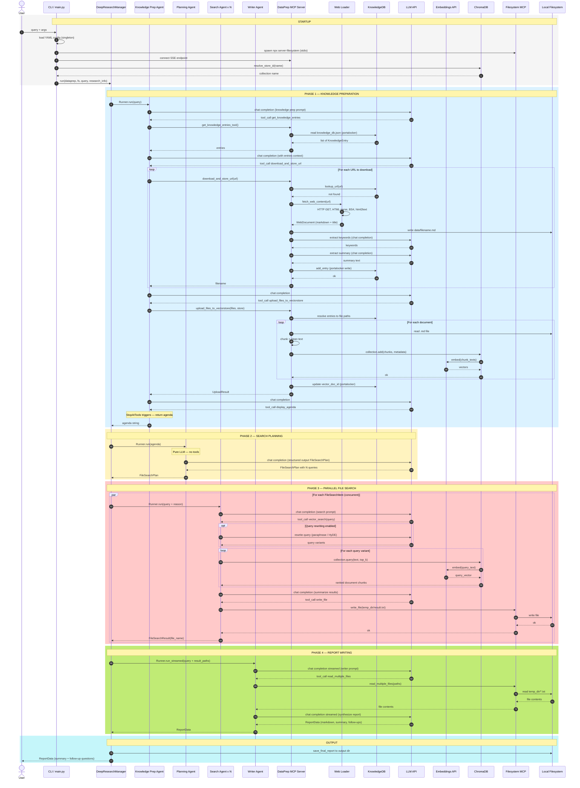

```mermaid
sequenceDiagram
    autonumber

    actor User
    participant CLI as CLI / main.py
    participant Mgr as DeepResearchManager
    participant KPAgent as Knowledge Prep Agent
    participant PlanAgent as Planning Agent
    participant SearchAgent as Search Agent x N
    participant WriterAgent as Writer Agent
    participant DataPrep as DataPrep MCP Server
    participant WebLoader as Web Loader
    participant KDB as KnowledgeDB
    participant LLM as LLM API
    participant Embed as Embeddings API
    participant Chroma as ChromaDB
    participant FSMCP as Filesystem MCP
    participant FS as Local Filesystem

    rect rgb(245, 245, 245)
        Note over CLI,FS: STARTUP
        User->>CLI: query + args
        CLI->>CLI: load YAML config (singleton)
        CLI->>FSMCP: spawn npx server-filesystem (stdio)
        CLI->>DataPrep: connect SSE endpoint
        CLI->>Chroma: resolve_store_id(name)
        Chroma-->>CLI: collection name
        CLI->>Mgr: run(dataprep, fs, query, research_info)
    end

    rect rgb(219, 242, 255)
        Note over Mgr,FS: PHASE 1 — KNOWLEDGE PREPARATION
        Mgr->>KPAgent: Runner.run(query)

        KPAgent->>LLM: chat completion (knowledge prep prompt)
        LLM-->>KPAgent: tool_call get_knowledge_entries

        KPAgent->>DataPrep: get_knowledge_entries_tool()
        DataPrep->>KDB: read knowledge_db.json (portalocker)
        KDB-->>DataPrep: list of KnowledgeEntry
        DataPrep-->>KPAgent: entries

        KPAgent->>LLM: chat completion (with entries context)
        LLM-->>KPAgent: tool_call download_and_store_url

        loop For each URL to download
            KPAgent->>DataPrep: download_and_store_url(url)
            DataPrep->>KDB: lookup_url(url)
            KDB-->>DataPrep: not found

            DataPrep->>WebLoader: fetch_web_content(url)
            WebLoader->>WebLoader: HTTP GET, HTML parse, BS4, html2text
            WebLoader-->>DataPrep: WebDocument (markdown + title)

            DataPrep->>FS: write data/filename.md
            DataPrep->>LLM: extract keywords (chat completion)
            LLM-->>DataPrep: keywords
            DataPrep->>LLM: extract summary (chat completion)
            LLM-->>DataPrep: summary text

            DataPrep->>KDB: add_entry (portalocker write)
            KDB-->>DataPrep: ok
            DataPrep-->>KPAgent: filename
        end

        KPAgent->>LLM: chat completion
        LLM-->>KPAgent: tool_call upload_files_to_vectorstore

        KPAgent->>DataPrep: upload_files_to_vectorstore(files, store)

        DataPrep->>KDB: resolve entries to file paths
        loop For each document
            DataPrep->>FS: read .md file
            DataPrep->>DataPrep: chunk + clean text
            DataPrep->>Chroma: collection.add(chunks, metadata)
            Chroma->>Embed: embed(chunk_texts)
            Embed-->>Chroma: vectors
            Chroma-->>DataPrep: ok
        end
        DataPrep->>KDB: update vector_doc_id (portalocker)
        DataPrep-->>KPAgent: UploadResult

        KPAgent->>LLM: chat completion
        LLM-->>KPAgent: tool_call display_agenda
        Note over KPAgent: StopAtTools triggers — return agenda
        KPAgent-->>Mgr: agenda string
    end

    rect rgb(255, 243, 191)
        Note over Mgr,LLM: PHASE 2 — SEARCH PLANNING
        Mgr->>PlanAgent: Runner.run(agenda)
        Note over PlanAgent: Pure LLM — no tools
        PlanAgent->>LLM: chat completion (structured output FileSearchPlan)
        LLM-->>PlanAgent: FileSearchPlan with N queries
        PlanAgent-->>Mgr: FileSearchPlan
    end

    rect rgb(255, 201, 201)
        Note over Mgr,FS: PHASE 3 — PARALLEL FILE SEARCH
        par For each FileSearchItem (concurrent)
            Mgr->>SearchAgent: Runner.run(query + reason)

            SearchAgent->>LLM: chat completion (search prompt)
            LLM-->>SearchAgent: tool_call vector_search(query)

            opt Query rewriting enabled
                SearchAgent->>LLM: rewrite query (paraphrase / HyDE)
                LLM-->>SearchAgent: query variants
            end

            loop For each query variant
                SearchAgent->>Chroma: collection.query(text, top_k)
                Chroma->>Embed: embed(query_text)
                Embed-->>Chroma: query_vector
                Chroma-->>SearchAgent: ranked document chunks
            end

            SearchAgent->>LLM: chat completion (summarize results)
            LLM-->>SearchAgent: tool_call write_file

            SearchAgent->>FSMCP: write_file(temp_dir/result.txt)
            FSMCP->>FS: write file
            FS-->>FSMCP: ok
            FSMCP-->>SearchAgent: ok

            SearchAgent-->>Mgr: FileSearchResult(file_name)
        end
    end

    rect rgb(192, 235, 117)
        Note over Mgr,FS: PHASE 4 — REPORT WRITING
        Mgr->>WriterAgent: Runner.run_streamed(query + result_paths)

        WriterAgent->>LLM: chat completion streamed (writer prompt)
        LLM-->>WriterAgent: tool_call read_multiple_files

        WriterAgent->>FSMCP: read_multiple_files(paths)
        FSMCP->>FS: read temp_dir/*.txt
        FS-->>FSMCP: file contents
        FSMCP-->>WriterAgent: file contents

        WriterAgent->>LLM: chat completion streamed (synthesize report)
        LLM-->>WriterAgent: ReportData (markdown, summary, follow-ups)
        WriterAgent-->>Mgr: ReportData
    end

    rect rgb(197, 246, 250)
        Note over Mgr,FS: OUTPUT
        Mgr->>FS: save_final_report to output dir
        Mgr-->>User: ReportData (summary + follow-up questions)
    end
```
